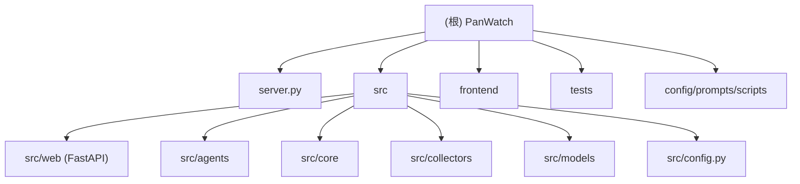

# CLAUDE.md — PanWatch (盯盘侠)

变更记录 (Changelog):
- 2026-06-17: 全量扫描重构文档结构, 新增模块 CLAUDE.md + Mermaid 架构图

---

## 项目愿景

自托管 AI 股票助手。实时行情监控、技术分析、多账户投资组合管理、模拟交易。支持 A 股、港股、美股。

## 架构总览



## 模块索引

| 模块路径 | 职责 | 语言 | 入口 | 测试 |
|---|---|---|---|---|
| `src/web/` | FastAPI REST API, SQLAlchemy ORM, JWT 认证 | Python | `app.py` | 通过 API 路由覆盖 |
| `src/agents/` | 6 个 Agent 实现 (盘前/盘中/复盘/新闻/技术/深度分析) | Python | `base.py` | `tests/test_intraday_monitor*.py` |
| `src/core/` | AI 客户端、通知、调度、模拟盘引擎、策略引擎、数据源编排 | Python | (库模块) | `tests/test_notify_policy.py`, `tests/test_json_safe.py` |
| `src/core/providers/` | 行情/K线/资金流/事件 多数据源主备调度 | Python | `orchestrator.py` | `tests/test_quote_orchestrator.py`, `tests/test_kline_orchestrator.py` |
| `src/core/signals/` | 策略信号生成包 (SignalPack) | Python | `signal_pack.py` | — |
| `src/collectors/` | 无状态数据采集器 (akshare, efinance 等) | Python | (库模块) | — |
| `src/models/` | 市场定义 (MarketCode, TradingSession) | Python | `market.py` | — |
| `frontend/` | React + TypeScript + Vite, shadcn/ui, pnpm workspaces | TS/TSX | `main.tsx` → `App.tsx` | — |
| `frontend/packages/api/` | 前端 API 客户端 + TypeScript 类型定义 | TS | `index.ts` | — |
| `frontend/packages/base-ui/` | shadcn/ui 基础组件库 | TSX | `index.ts` | — |
| `frontend/packages/biz-ui/` | 业务组件 (K线图, 深度分析弹窗等) | TS/TSX | `index.ts` | — |
| `tests/` | 23 个 pytest 单测文件 | Python | `conftest.py` | — |

## 运行与开发

```bash
# 后端
python server.py                        # 启动 (port 8000)
make dev-api                            # 一键: venv + 依赖 + uvicorn --reload

# 前端
cd frontend && pnpm install && pnpm dev  # Dev (port 5183)
cd frontend && pnpm build                # 构建输出到 frontend/dist
make dev-web                             # 一键: pnpm install + dev

# 测试
python -m pytest tests/ -v               # 全部单测 (默认不发通知)
python -m pytest tests/ -v --notify      # 发真实通知
python -m pytest tests/test_paper_trading_notify.py -v  # 单个文件

# Git Hooks
bash scripts/install-hooks.sh           # 安装 pre-push hook

# Docker
./build.sh <version>                    # 构建前端 + Docker 镜像
```

## 测试策略

- 默认屏蔽通知发送 (`conftest.py` monkeypatch NotifierManager)
- `--notify` 参数恢复真实发送 (集成测试用)
- 测试函数必须写中文 docstring 首行, `pytest_itemcollected` hook 自动显示为中文节点名
- 配置: `pyproject.toml` 定义 testpaths
- CI: `.github/workflows/release.yml` docker build 前跑测试, 失败中断

## 编码规范

- Python: PEP 8, 类型注解, `snake_case` 文件/函数, `PascalCase` 类
- TypeScript: `PascalCase.tsx` 组件, `use-` 前缀 hooks, `camelCase.ts` 工具
- 提交: `<type>: <subject>`, type ∈ {feat, fix, docs, refactor, style, test, chore}
- 用户界面文本一律中文
- 策略名称在 `paper_trading_notifier.py` 的 `STRATEGY_NAME_MAP` 有中文映射

## AI 使用指引

- 新 Agent: 继承 `BaseAgent` (src/agents/base.py), 实现 `collect()` + `build_prompt()`, 注册到 `server.py`
- 新数据源: 在 `src/core/providers/` 下按类型子目录添加 provider 实现, 注册到 `server.py` 的 `seed_providers()`
- API 路由: 加文件到 `src/web/api/`, 在 `src/web/app.py` 注册 router
- 前端新页面: 加文件到 `frontend/src/pages/`, 在 `App.tsx` 注册 `<Route>`
- API 响应自动被 `ResponseWrapperMiddleware` 包装为 `{code, success, data, message}` 格式
- TradingAgents 是软依赖 (`tradingagents@git+...`), 未安装时返回明确错误

## 数据流

```
┌─────────────┐    ┌──────────────┐    ┌──────────────┐
│  Timed Job   │───>│  Agent       │───>│  AI Client   │
│ (APScheduler)│    │ (BaseAgent)  │    │ (OpenAI-compat)│
└─────────────┘    └──────┬───────┘    └──────────────┘
                          │
                    ┌─────▼──────┐
                    │  SignalPack │
                    │ (结构化输入) │
                    └─────┬──────┘
                          │
              ┌───────────┼───────────┐
              ▼           ▼           ▼
       ┌──────────┐ ┌──────────┐ ┌──────────┐
       │ Providers │ │Collectors│ │ Position │
       │(主备调度) │ │ (akshare)│ │ (DB)     │
       └──────────┘ └──────────┘ └──────────┘
```

## 覆盖率报告

扫描时间: 2026-06-17 23:29 +0800
估算总文件数: ~200+
已扫描核心文件: 60+
覆盖范围: 全模块识别完成, 所有关键入口/模型/API/Agent 已扫描

### 扫描缺口

- `src/web/api/` 有 21 个路由文件, 未逐文件读取细节 (可通过 API 路由名推断职责)
- `src/core/providers/` 各 provider 实现细节未遍历
- `frontend/src/pages/` 各页面实现细节未遍历 (可通过路由名推断)
- `src/core/signals/structured_output.py` 等工具模块未读

### 下一步推荐扫描

1. `src/web/api/` — 逐路由确认端点签名 (需要时)
2. `src/core/providers/` 各 provider 实现 (数据源调优时)
3. `frontend/src/pages/` 页面实现 (UI 修改时)
4. `src/web/migrations.py` — 版本化迁移逻辑
